

  <a href="docs/images/banner-ocean-dark.svg">
    <picture>
      <source media="(prefers-color-scheme: dark)" srcset="docs/images/banner-ocean-dark.svg">
      <source media="(prefers-color-scheme: light)" srcset="docs/images/banner-ocean-light.svg">
      
    </picture>
  </a>

  

    <strong>Compare GitHub repositories side-by-side with high-density metrics, deep analytics, and publication-ready battle cards.</strong>
  

  

    &nbsp;
    &nbsp;
    &nbsp;
    &nbsp;
    
  

  

    &nbsp;
    &nbsp;
    &nbsp;
    &nbsp;
    
  

   

  <a href="docs/images/octoclash-dark-preview.png">
    <picture>
      <source media="(prefers-color-scheme: dark)" srcset="docs/images/octoclash-dark-preview.png">
      <source media="(prefers-color-scheme: light)" srcset="docs/images/octoclash-light-preview.png">
      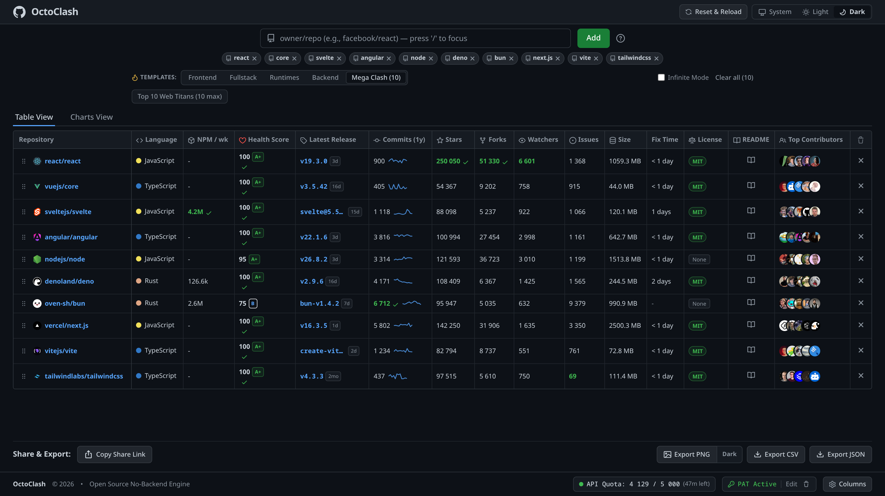
    </picture>
  </a>

---

## ⚡ Overview

**OctoClash** is a client-side benchmarking and intelligence suite for evaluating open-source software. Compare any combination of GitHub repositories across activity velocity, release cadences, maintenance health scores, weekly package registry volume, and community size without installing software or creating an account.

Everything runs directly in the browser: state is synced to URL permalinks, comparisons export as structured datasets (CSV / JSON), and graphics render directly via an in-memory Canvas 2D engine.

---

## 🚀 Key Features

### 📊 Dense Comparison Matrix
- **52-Week Commit Velocity**: Real-time activity sparklines calculated per repository.
- **Maintenance Health Score**: Algorithmic rating (0–100) factoring in release freshness, issue closure turnaround, SPDX licensing, and active maintainer depth (`A+` through `F`).
- **NPM Weekly Traction**: Live download statistics pulled directly from the npm registry.
- **Interactive Maintainers & Top Contributors**: Hover avatars in the matrix or charts to inspect GitHub handles in accessible tooltips, and click to navigate directly to their GitHub profiles.
- **Drag-and-Drop Reordering**: Tactile row reordering powered by `@dnd-kit` with keyboard and pointer sensor precision.
- **Multi-State Column Sorting**: Sort by stars, forks, issues, size, or health score with asc/desc/reset states.
- **Customizable Columns**: Hide or display any metric via the settings panel.
- **In-App README Viewer**: Built-in modal with DOMPurify sanitization and GitHub dark/light mode image compatibility.

### 🎴 Battle Card PNG Engine (Multi-Part Infinite Export)
Synthesize battle cards for social sharing, technical documentation, or engineering reviews:
- Rendered on-the-fly via native HTML5 Canvas at 2x retina density.
- Independent Theme Switcher: Export in dark or light mode regardless of current UI theme.
- **Infinite Mode Multi-Part Generation**: When comparing more than 10 repositories, the export engine automatically chunks cards into 10-repo parts (`Part 1 of N`, `Part 2 of N`), downloading each part sequentially.

<a href="docs/images/battle-card-dark.png">
  <picture>
    <source media="(prefers-color-scheme: dark)" srcset="docs/images/battle-card-dark.png">
    <source media="(prefers-color-scheme: light)" srcset="docs/images/battle-card-light.png">
    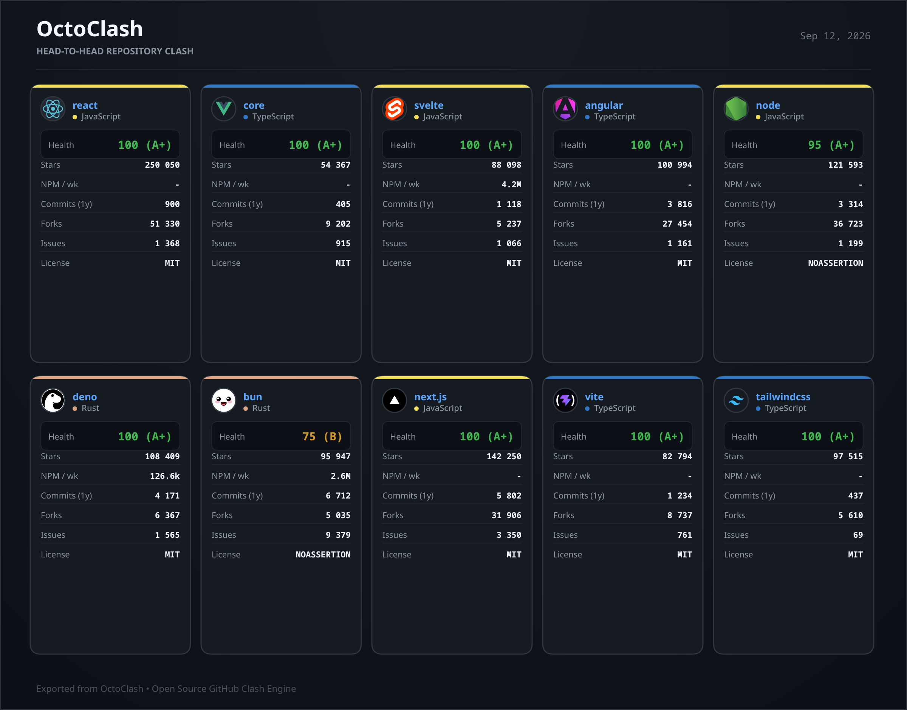
  </picture>
</a>

### 📈 Multi-Angle Charts View
Instantly pivot from the tabular matrix into interactive visual charts:
- Health and maintenance scores
- Star growth trajectories from project inception to present with pagination synthesis
- Update frequency and commit volume
- Top contributor community benchmarks

<a href="docs/images/charts-dark-preview.png">
  <picture>
    <source media="(prefers-color-scheme: dark)" srcset="docs/images/charts-dark-preview.png">
    <source media="(prefers-color-scheme: light)" srcset="docs/images/charts-light-preview.png">
    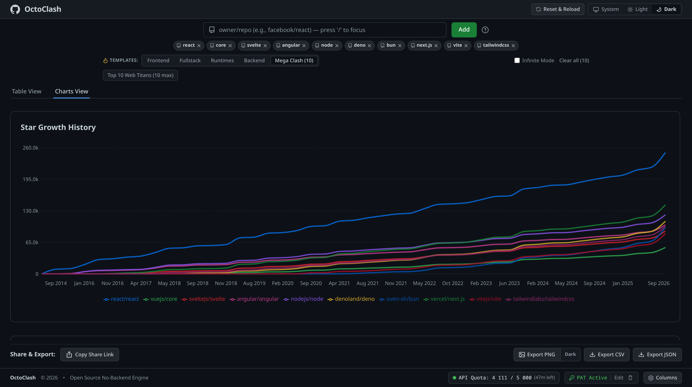
  </picture>
</a>

### 🎯 Curated Presets
One-click presets across key modern developer ecosystems:
- **Frontend**: React vs. Vue vs. Svelte
- **Fullstack**: Next.js vs. Nuxt vs. SvelteKit vs. Remix vs. Astro
- **Runtimes**: Node.js vs. Deno vs. Bun
- **Backend**: Express vs. Fastify vs. NestJS vs. Koa vs. Hono
- **Mega Clash**: Top 10 Web Titans loaded simultaneously

---

## 🛠 Tech Stack

| Component | Technology | Rationale |
|---|---|---|
| **Core Framework** | React 19 | Concurrent rendering, zero-overhead component trees |
| **Build Tooling** | Vite 8.3 | Rapid HMR, optimized tree-shaking and Rollup asset pipeline |
| **Design System** | Primer Design Tokens + Tailwind CSS | Native GitHub aesthetics, WCAG AAA contrast ratios |
| **Interaction Engine** | `@dnd-kit` | Accessible pointer & keyboard drag-and-drop mechanics |
| **State Management** | Zustand 5 | Lightweight immutable state with localStorage persistence |
| **Rendering Engine** | Native HTML5 Canvas 2D | In-memory image generation with zero backend dependencies |
| **Sanitizer** | DOMPurify | Strict XSS defense for external README markup |
| **Icons** | `@primer/octicons-react` | GitHub native iconography |

---

## 🔑 GitHub API Limits & PAT Support

OctoClash operates out-of-the-box using the public GitHub API (60 requests/hr per IP).

For uninterrupted high-volume comparisons:
1. Enter a GitHub Personal Access Token (PAT) directly into the token input in the footer (or click **Get PAT** to generate one on GitHub).
2. Your rate limit raises to **5,000 requests/hr**. The token is stored strictly in your browser session storage and is never sent to any external server.

---

## 🖼️ Interface Gallery

Comprehensive visual showcase across dark and light themes:

### 🚀 Interactive Preset Launchpad
<a href="docs/images/launchpad-dark.png">
  <picture>
    <source media="(prefers-color-scheme: dark)" srcset="docs/images/launchpad-dark.png">
    <source media="(prefers-color-scheme: light)" srcset="docs/images/launchpad-light.png">
    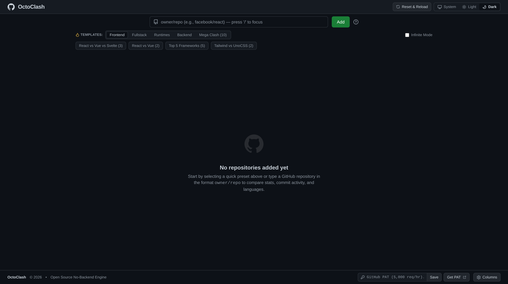
  </picture>
</a>

### 📊 Comparison Matrix & Benchmarks
<a href="docs/images/octoclash-dark-preview.png">
  <picture>
    <source media="(prefers-color-scheme: dark)" srcset="docs/images/octoclash-dark-preview.png">
    <source media="(prefers-color-scheme: light)" srcset="docs/images/octoclash-light-preview.png">
    
  </picture>
</a>

### ♾️ Infinite Mode Multi-Repository View
<a href="docs/images/infinite-mode-dark.png">
  <picture>
    <source media="(prefers-color-scheme: dark)" srcset="docs/images/infinite-mode-dark.png">
    <source media="(prefers-color-scheme: light)" srcset="docs/images/infinite-mode-light.png">
    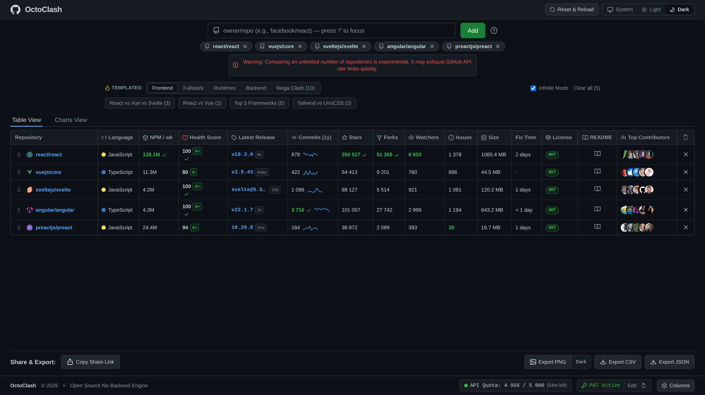
  </picture>
</a>

### 📈 Multi-Angle Analytics & Velocity Charts
<a href="docs/images/charts-dark-preview.png">
  <picture>
    <source media="(prefers-color-scheme: dark)" srcset="docs/images/charts-dark-preview.png">
    <source media="(prefers-color-scheme: light)" srcset="docs/images/charts-light-preview.png">
    
  </picture>
</a>

### 🎯 Comparative Metrics & Statistical Summary
<a href="docs/images/radar-benchmark-dark.png">
  <picture>
    <source media="(prefers-color-scheme: dark)" srcset="docs/images/radar-benchmark-dark.png">
    <source media="(prefers-color-scheme: light)" srcset="docs/images/radar-benchmark-light.png">
    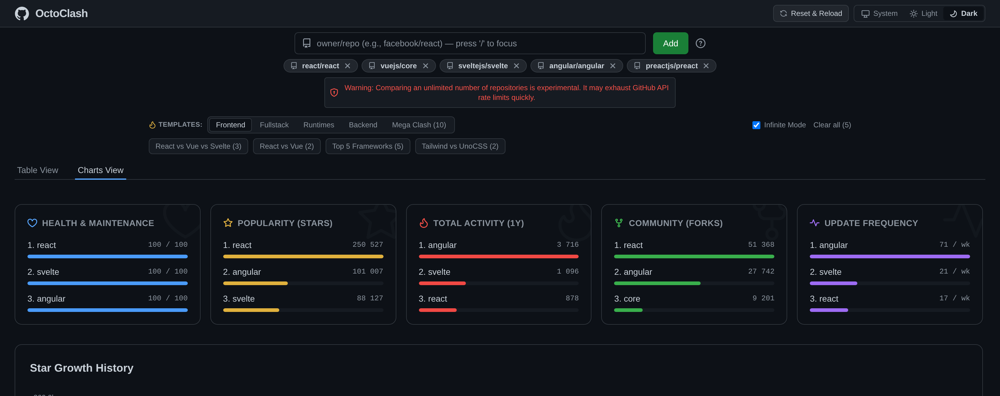
  </picture>
</a>

### 🌐 Language Distribution Matrix
<a href="docs/images/languages-breakdown-dark.png">
  <picture>
    <source media="(prefers-color-scheme: dark)" srcset="docs/images/languages-breakdown-dark.png">
    <source media="(prefers-color-scheme: light)" srcset="docs/images/languages-breakdown-light.png">
    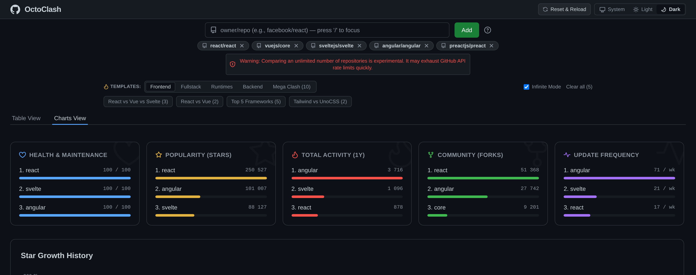
  </picture>
</a>

### 👥 Interactive Maintainers & Contributor Profiles
Hovering over any contributor avatar renders an accessible tooltip with their GitHub handle; clicking opens their profile directly in a new tab:

<a href="docs/images/contributors-table-dark.png">
  <picture>
    <source media="(prefers-color-scheme: dark)" srcset="docs/images/contributors-table-dark.png">
    <source media="(prefers-color-scheme: light)" srcset="docs/images/contributors-table-light.png">
    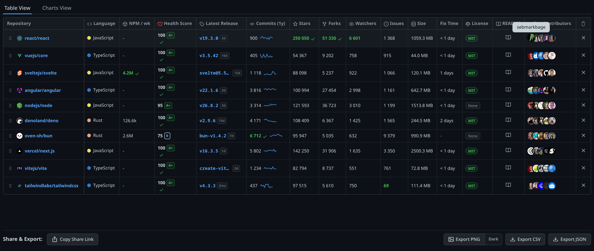
  </picture>
</a>

<a href="docs/images/contributors-grid-dark.png">
  <picture>
    <source media="(prefers-color-scheme: dark)" srcset="docs/images/contributors-grid-dark.png">
    <source media="(prefers-color-scheme: light)" srcset="docs/images/contributors-grid-light.png">
    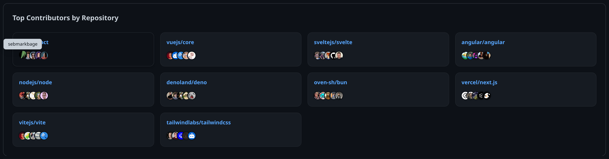
  </picture>
</a>

### 🎴 Battle Card Generator (2x Retina Density)
<a href="docs/images/battle-card-dark.png">
  <picture>
    <source media="(prefers-color-scheme: dark)" srcset="docs/images/battle-card-dark.png">
    <source media="(prefers-color-scheme: light)" srcset="docs/images/battle-card-light.png">
    
  </picture>
</a>

### ⚙️ Column Customization Panel
<a href="docs/images/settings-dark.png">
  <picture>
    <source media="(prefers-color-scheme: dark)" srcset="docs/images/settings-dark.png">
    <source media="(prefers-color-scheme: light)" srcset="docs/images/settings-light.png">
    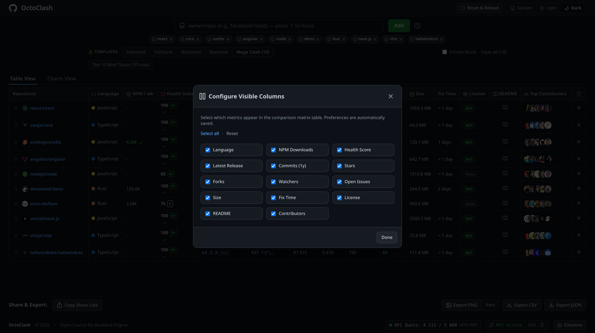
  </picture>
</a>

### 📖 In-App README Viewer Modal
<a href="docs/images/readme-modal-dark.png">
  <picture>
    <source media="(prefers-color-scheme: dark)" srcset="docs/images/readme-modal-dark.png">
    <source media="(prefers-color-scheme: light)" srcset="docs/images/readme-modal-light.png">
    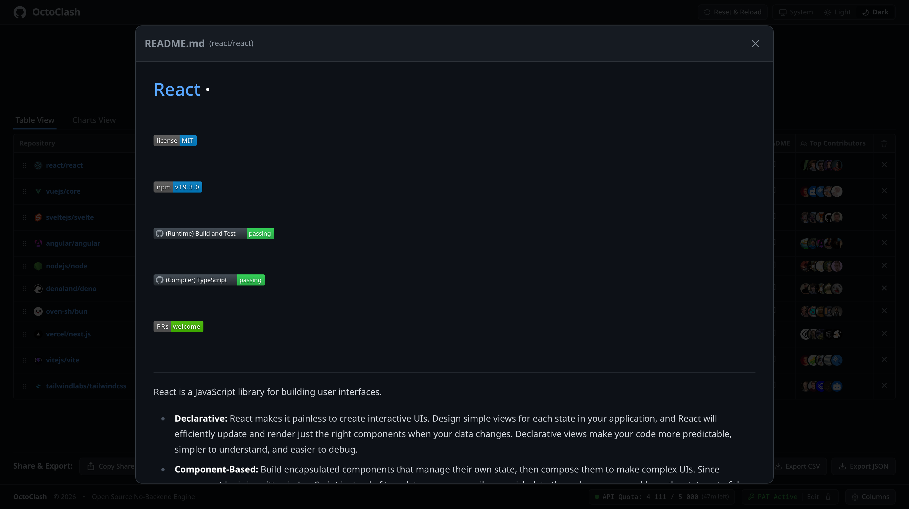
  </picture>
</a>

---

## 📄 License

Distributed under the **MIT License**. See [LICENSE](LICENSE) for more information.
